# Hackathon 2: Team Wonder Woman


In this second project we were appointed by Hypermobility to improve an existing dashboard with more real time data. Here is a brief of the project:

The original architecture::

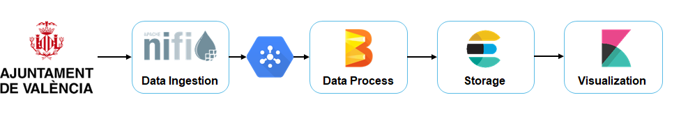

It received data from only one API of the Ayuntamiento de Valencia Spain, giving status information of all the Valenbisi bicycles located in Valencia, Spain. As follow:

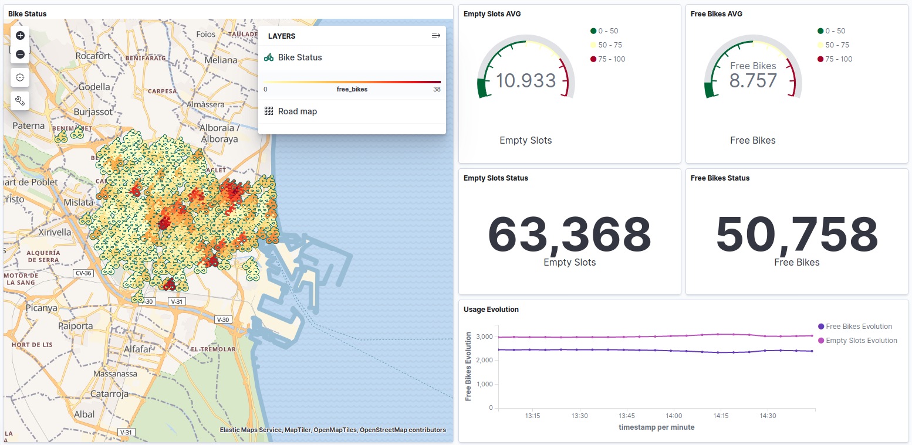


<br/>


First, we look for the Ayuntamiento de Valencia APIS:


| Name               | API          |
| --------           | -------------- |
| Traffic Status     | http://apigobiernoabiertortod.valencia.es/apirtod/rest/datasets/estado_trafico.json|
| Aparcabicis Loc    | http://gobiernoabierto.valencia.es/es/dataset/?id=aparcabicis|
| Bicycles Count        |http://gobiernoabierto.valencia.es/es/dataset/?id=puntos-medida-trafico-espiras-electromagneticas |
|Car Count      | http://apigobiernoabiertortod.valencia.es/apirtod/rest/datasets/intensidad_trafico.json |

_Traffic Status_: measure every 3 min a linestring UTM zone 30 (Spain) coordinates, related to the following value for specific traffic status:


* 0 Fluido - Fluid
* 1 Denso - Dense
* 2 Congestionado - Congested
* 3 Cortado – Out of line

_Aparcabicis Loc_: Is a complete data set of the location of every parking structure build in the city.

_Bicycles Count_: Is a measure in real time of the number of bicycles that pass through certain point of the city due induction loop traffic detector.

_Cars Count_: Is a measure in real time of the number of Cars that pass through certain point of the city due induction loop traffic detector.


## Now the cherry in the top of the ice cream: 


Twitter developers APi allows you to create apps that take advantage of integration with Twitter features such as user profiles, tweets, timelines, and search.

Using the filter (“Patinetes”) the dashboard will show in real time the tends that follow the world of patinetes.

# Now we present our MVP:

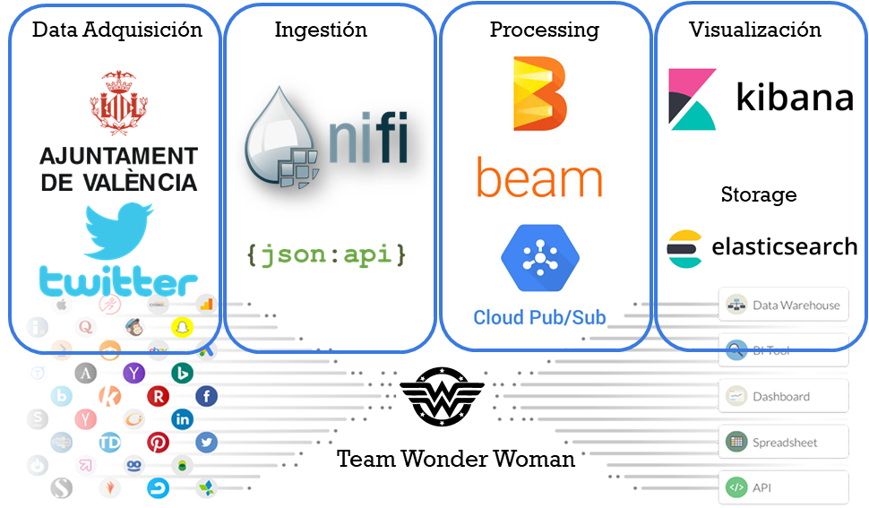

The following exercise will be performance in the follow environment:

* Linux --version (Ubuntu(64bit))
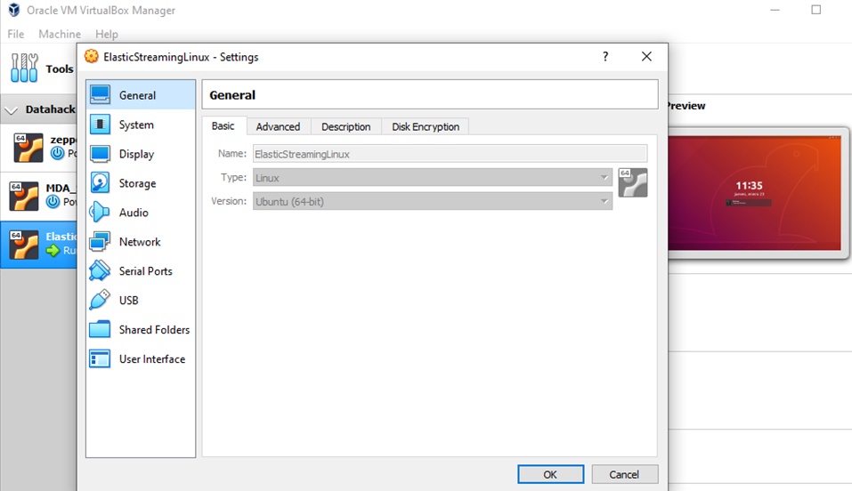

* elasticsearch --version 7.4.2
* Kibana        --version 7.4.2
* Nifi          --version 1.9.2
* Google Cloud (Pub/Sub)

## To follow this exercise, after creating the needed environment in linux, the first step is downloading the coding to you machines:

We are going to use already provided ElasticStreaming Virtual Machine, but we need to configure it with a minimum of  6GB of RAM. 

* Start virtual machine and logon. 

Go to the terminal in you virtual machine:

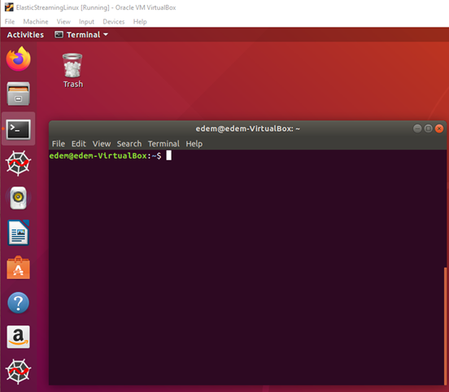

In the terminal, change directory where you want to download the files and type:

```
mkdir New_Project
cd New_Project
git clone https://github.com/luisnose/Data_project2.git
```

We are  going to use already provided ElasticStreaming Virtual Machine, but we need to configure it to use 6GB of RAM. 

* Start virtual machine and logon. 

* Open Web Browser and go to  http://console.cloud.google.com/

* Create a new project called hackathon and move to it. 
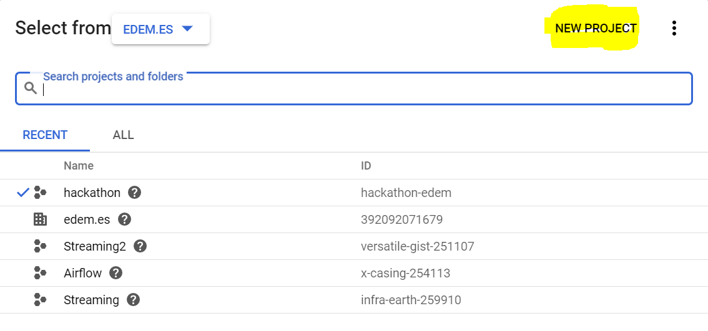<br/>

* Go to pub/sub on left panel and create topic calling it valenbisi.
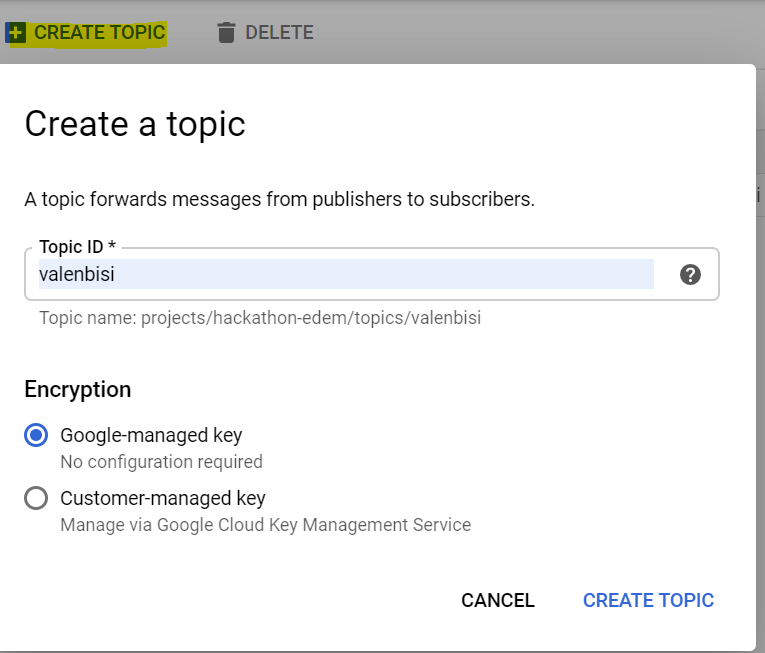<br/>

* Click to the topic already created go down and click on Create Subscription called streaming, left rest as default:
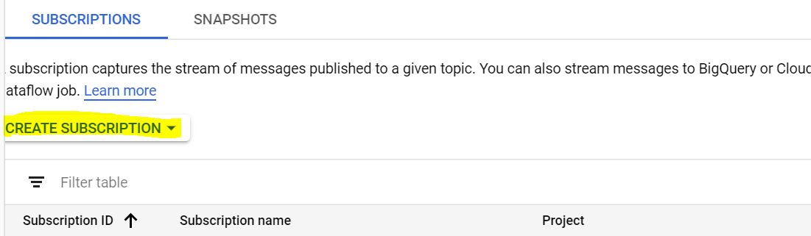
<br/>
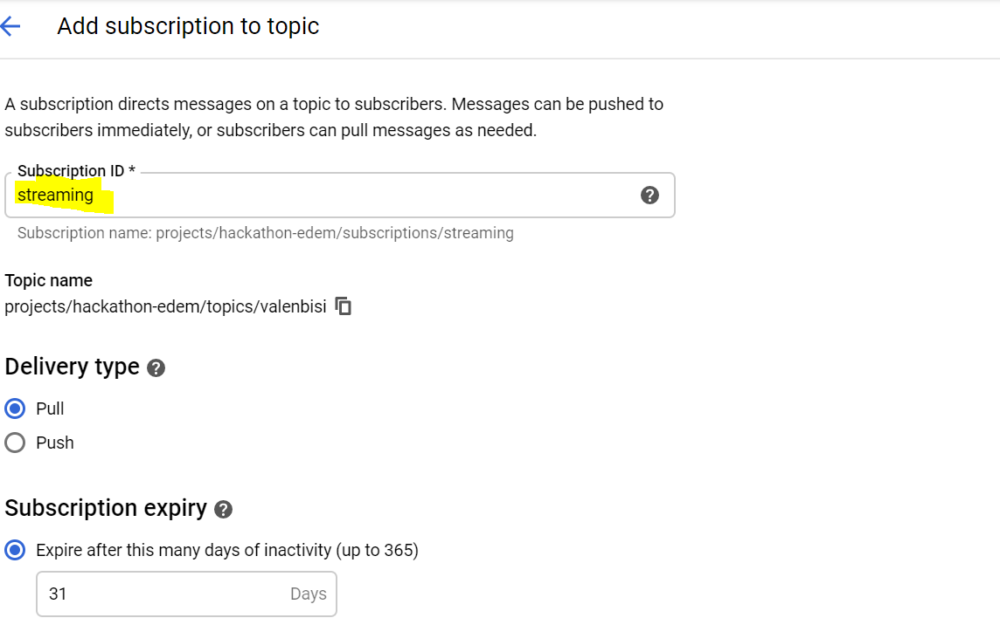

* Donwload key to be able to consume and populate messages to pub/sub. 
	* Go to left panel to IAM & admin --> Service accounts
	* Click on Create Service  Account
	* Create service account called streaming, and click on Continue:<br/>
	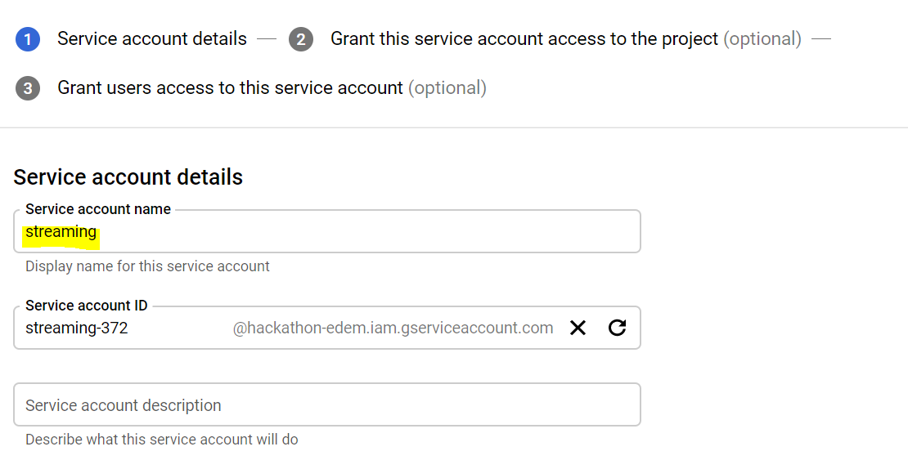<br/>
	
	* Add permissions to pub/sub read and consume, and click Continue:<br/>
	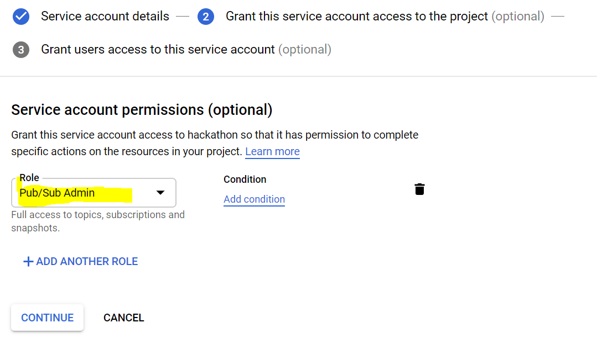<br/>
	
	* Click on Create key, select JSON as key type and finally on Done. That will download a Json file with your credentials:<br/>
	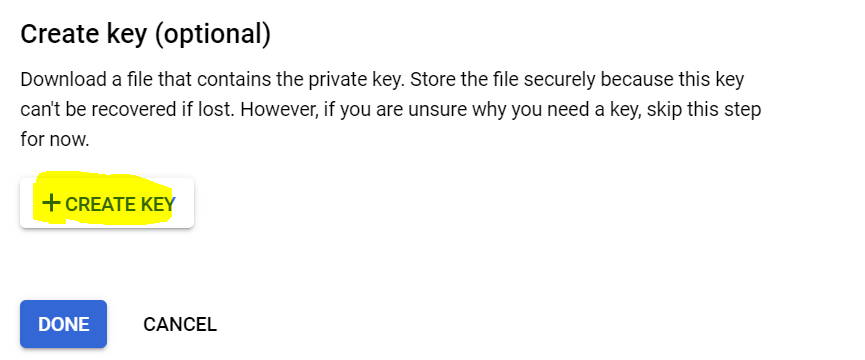<br/>
	
	
* Enable pub/sub API
	* Going to API & Services on left panel 
	* Click on Enable Apis & Services
	* Look for Pub/Sub and enable it. 

* Open a terminal and move the json key downloaded to Crendentials folder. Run the following:


```
cp Downloads/your_downloaded_credentials.json Credentials/mobilityApp.json
```  
**Carefull** \
_your_downloaded_credentials.json_ -> replace with the downloaded file name from google cloud, it must be in the Download directory.

* Edit /home/edem/bash.rc file commenting previous crendentials and adding this one as google application credentials:
```
#export GOOGLE_APPLICATION_CREDENTIALS=/home/edem/Credentials/iexCloudApp.json
export GOOGLE_APPLICATION_CREDENTIALS=/home/edem/Credentials/mobilityApp.json
```
**Carefull** \
mobilityApp.json_ -> s the name of the credential that will require NIFI


<br/>
In this point we have successfully created one topic name __”Valenbisi”__, this topic will receive the data coming from Apache NIFI(In this case a Json file) and the subscription __”Streaming”__ is the responsible for delivering the data, through a given script in Apache Beam, that we will discuss later in this brief.

Taking in consideration that in this exercise we are going to receive information from 6 different APIs. In total 6 different topics were created with the respective subscriptions as follow:

<br/>

**Carefull** \
Remember each _subscription_ belong to a _topic_ in later on, each one is going to be related to a specific NIFI and BEAM process 


## For Apache Beam in python we will be using the following libraries that do not come with the regular libraries of Python, so its time to install them:

* Run the following in the terminal:
```
pip install elasticsearch
pip install ast
pip install utm
```

__ast__ library is need it in this exercise to eval a string and converted it into a list or a dictionary types.\
__utm__ library is going to convert the utm coordinates to the lat and long coordinates


## Run the platform

* Launch elasticsearch:
	* Open a terminal and run the following
	```
	Software/elasticsearch-7.4.2/bin/elasticsearch
	```  

* Launch kibana:
```
Software/kibana-7.4.2-linux-x86_64/bin/kibana
```  

* Open web browser to validate that kibana has been launched successfully --> http://localhost:5601

Before start sending the data to elasticsearch and the attributes storage as a text and not as the type that we need. For example, the location attribute must be a __Geo-Point__ in order to be able to be use in the program. we need to create the Index in for each one of our data set, 

In this exercise will be 6 data sets, as follow:

    * _Valenbisi_ -> Valencibisi bicycles
    * _Estado_trafico_ -> Traffic in real time
    * _Ubicacion_aparcabicis_ -> Location of the parking in around the city
    * _Trafico_espiras_ -> the count of vehicules in certain points
    * _Trafico_bicis_espiras_ -> the count of biclycles in certain points
    * _Twitter_index_ -> Twitter depeloper data ser

In order to create them, go to Dev Tools on left pannel and create a mapping for location geo point. Copy and paste the following commands:

For the Valenbisi index:
```
PUT valenbisi
{
  "mappings": {
    "properties": {
      "location": {
        "type": "geo_point"
      }
    }
  }
}
```
For the estado_trafico index:
```
PUT estado_trafico
{
  "mappings": {
    "properties": {
      "location": {
        "type": "geo_point"
      },"estado": {
        "type": "long"
      }
    }
  }
}
```
For the locations of bicycles index:
```
PUT ubicacion_aparcabicis
{
  "mappings": {
    "properties": {
      "location": {
        "type": ""
      },"plazas": {
        "type": "long"
      }
    }
  }
}
```
For the bicycle count index:
```
PUT trafico_espiras
{
  "mappings": {
    "properties": {
      "location": {
        "type": "geo_point"
      },"intensidad": {
        "type": "long"
      },"sensor": {
        "type": "long"
      },"angulo": {
        "type": "long"
      }
    }
  }
}
```
For the Cars Count index:
```
PUT trafico_bicis_espiras
{
  "mappings": {
    "properties": {
      "location": {
        "type": "geo_point"
      },"intensidad": {
        "type": "long"
      },"punto_medida": {
        "type": "long"
      },"angulo": {
        "type": "long"
      }
    }
  }
}
```
Finally, for the Twitter index:
```
PUT twitter_index
{
  "mappings": {
    "properties": {
      "created_at": {
        "type": "date",
        "format": "EEE MMM dd HH:mm:ss Z yyyy"
      },"hashtags": {
                "type": "text",
                "fields": {
                  "keyword": {
                    "type": "keyword",
                    "ignore_above": 256
          }
        }
      }
    }
  }
}
 
```

* Setup the Dashboards. Go to Management / Kibana (saved objects) / Import 
```
/home/edem/.../kibana/export.ndjson
```  

Now Kibana is Setup

<br/>

* Launch Apache Nifi:
	* Launch Nifi application
	```
	Software/nifi-1.9.2/bin/nifi.sh run
	```  
	* Load Valenbici template available on 
    
    /home/edem/Data_project2//nifi/Ingestion_API_Ayuntamiento_and_Twitter.xml

this should 
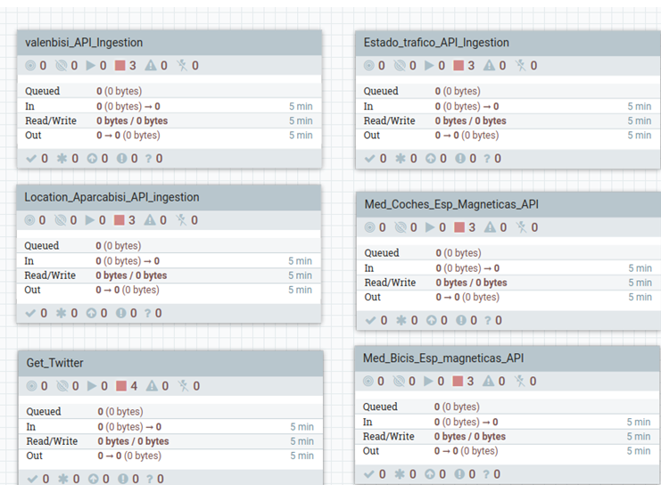<br/>

In the template are load the 6 _process group_, each belong to a different index, you can inspect each of the process group by doble clicking. as follow:

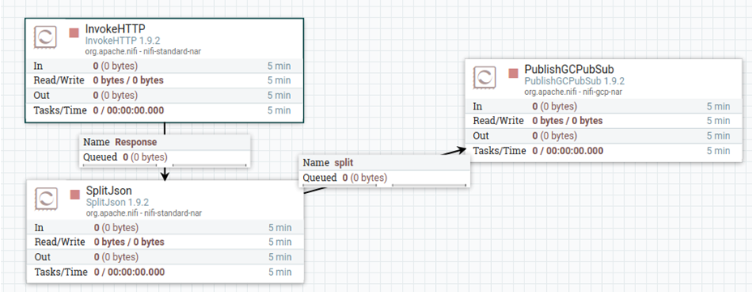<br/>

The first processor of each group is an InvokeHTTP, in the configuration/Properties is already load the __remote URL__ for each index.

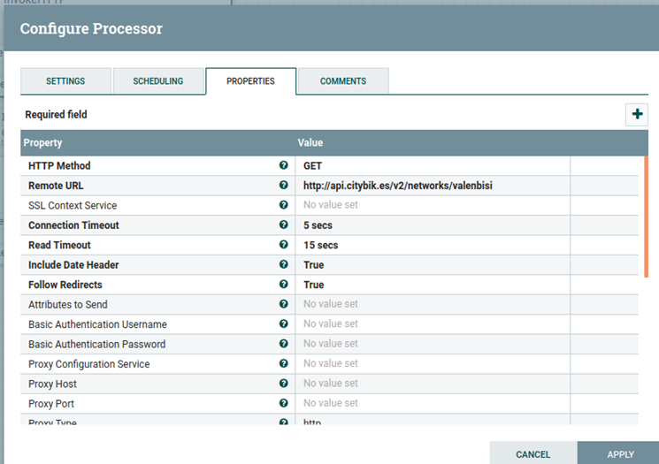<br/>

The last processor of each group is PublishGCPubSub processor, responsible to send the split json taken from the api to the respective topic created in Google Cloud. In configuration/Properties, you must fill the following:

Project ID
GCP Credentials Provider Service
Topic Name 

<br/>


The process in the middle of each Goup is normally a split json(Except for the Twitter API that will be explain later), taking in consideration that each API give us a complete json with the different points in the city as follow:


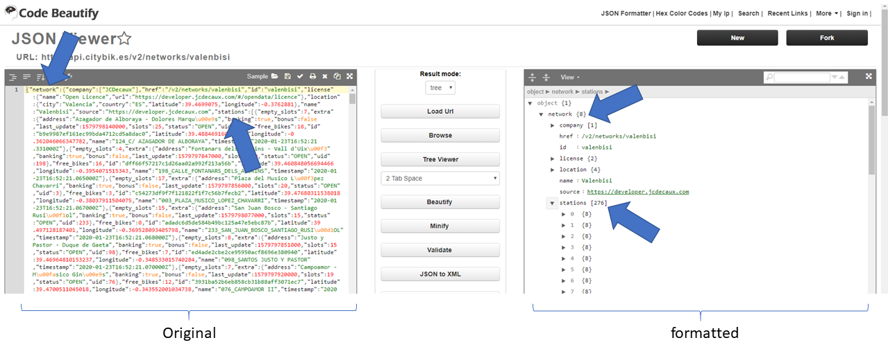<br/>

The second processor main function is split in separate json, in this Valenbisi case is a json follow this format ->
```
network {
station{‘’’
              ‘’’}
    }
```
and is need it a separate json for each station, the slitJson processor must follow the same pattern to do so:

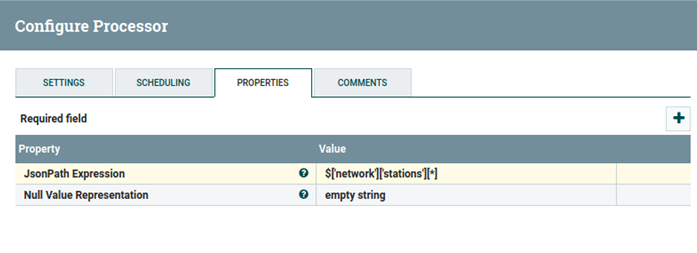<br/>


**Repeat** this for the others _Group Process_ . In order to be ready the processor must have the **Stop RED** bottom on the left. 


Now let’s configure the Twitter Group Processor:

<br/>

The first processor is the **Get_Twitter**, first need 4 Keys as follow:


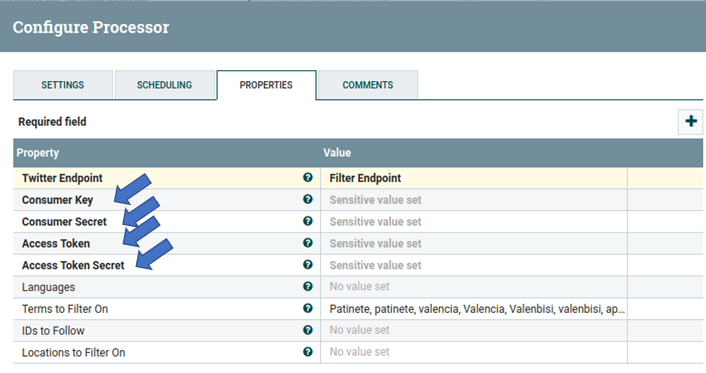<br/>


This video show the process to obtain the mention keys of the first processor 

https://www.youtube.com/watch?v=KPHC2ygBak4

The second and the third processor are used to obtain from the json file the need attributes, even though it’s possible to keep the whole file, for this exercise we keep the attributes that were relevant for us.  

The four and  last  processor is a PublishGCPubSub as the other groups, so the configuration/Properties, you must fill are also the following:

Project ID
GCP Credentials Provider Service
Topic Name 


Now NIFI is Setup

<br/>


The load configuration is set to filter for “ Valencia, patinete”. Those values can be change in any time to search for any keyword.


* Go to the Pub/Sub publisher Box, click on properties and configure the project to use your google project id created. 
	
    
    * Finally launch the workflow. 


	

* Validate on  Spyder console that you see the messages printed. 

* Go to Kibana dashboard and see that you see it updated on real time. 